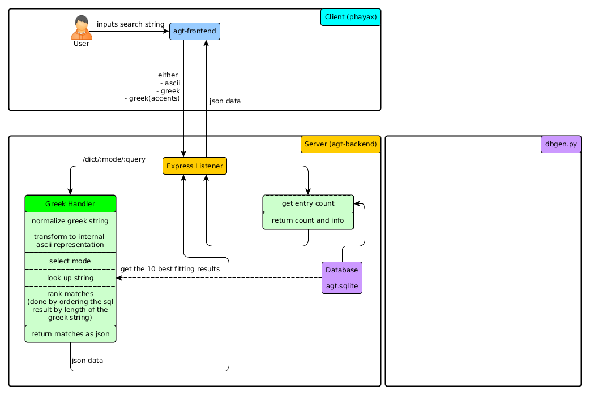

# agt-backend
Backend REST-API for an Ancient Greek Translator.

## What works
The "Alpha" version works. You can make requests and use both precise and rough mode. Currently it is still limited to ascii words. 

## TODO
Transform incoming requests to the internal ascii representation. That includes greek inputs.  
Maybe some small changes on the internal representation are necessary (e.g. ch -> c).  
Make sure all greek letters are mentioned in the simplification dict. There are still plenty of capital letters that are uncovered.  
Some frontend would be nice >.<.

## How it works
The website [operone.de](http://operone.de) has a [section](http://operone.de/altspr/wadinhalt.html) with an ancient greek dictionary.  
[dbgen.py](dbgen/dbgen.py) scrapes all the entries and writes them into a sqlite database.  
The node server then accesses the database and provides a REST-API.  
A rough scheme of how this works:  

## Data Model:
Currently there is one table in the database:
operonedict  
There exist indices for the rough- and preciseword columns.

#### operonedict
Every entry has the following fields:

|    field       |   description                                      |
|----------------|----------------------------------------------------|
| roughword      | The greek word transformed with the rough-dictionary |
| preciseword    | The greek word transformed with the precise dictionary |
| greek          | The primary lookup word.                           |
| alternategreek | All alternate words joined by commata              |
| translation    | The translation. This is still entirely unformatted|
  
